# Konzept: Ambient Occlusion

In der Realität wird Licht in Ecken und Ritzen weniger stark gestreut — es ist dort dunkler als auf freien Flächen. Das ist Ambient Occlusion.
Für Voxel gibt es eine elegante vereinfachte Version die 1994 von Mikael Andersson beschrieben wurde — Voxel AO — die ohne Raytracing auskommt und trotzdem überzeugend aussieht.



## Das Kernprinzip: Pro Vertex 3 Nachbarn
Jeder Vertex eines Quads liegt an einer Ecke. Um diesen Vertex herum gibt es genau 3 relevante Nachbar-Blöcke — zwei Seiten und eine Ecke:
```
     Side2
      │
      │  ← Vertex hier
──────┼──────
Side1 │ Corner
```

Die AO-Formel:
```csharp
int VertexAO(bool side1, bool side2, bool corner)
{
    if (side1 && side2) return 0;  // komplett verdeckt
    return 3 - (side1 ? 1 : 0) - (side2 ? 1 : 0) - (corner ? 1 : 0);
}
// Ergebnis: 0 (dunkelste) bis 3 (hellste)
```
## Wie der AO-Wert gerendert wird
Der AO-Wert wird als zusätzliches Vertex-Attribut gespeichert und im Shader zur Abdunkelung genutzt:

```glsl// Fragment Shader
float ao = TileAO / 3.0;          // 0.0 bis 1.0
float light = mix(0.3, 1.0, ao);  // 30% bis 100% Helligkeit
FragColor = texture(...) * light;
```

## Die wichtige Greedy-Meshing Interaktion

Hier liegt die eigentliche Tücke. Greedy Meshing fasst Flächen zusammen — aber AO-Werte sind pro Vertex unterschiedlich. Ein großes Quad das 4×3 Blöcke überspannt hat Vertices mit verschiedenen AO-Werten an den Ecken.

Das bedeutet: **AO-Werte müssen beim Greedy-Merge berücksichtigt werden** — zwei benachbarte Flächen dürfen nur zusammengefasst werden wenn sie denselben Block-Typ **und** dieselben AO-Werte haben.
```
Ohne AO-Check:     Mit AO-Check:
■ ■ ■ ■ ■          ■■ ■■ ■
= 1 Quad           = 3 Quads (unterschiedliche AO an Kanten)
```

Das reduziert den Greedy-Gewinn etwas — aber AO sieht so gut aus dass es den Kompromiss wert ist.

## Vertex-Format Erweiterung
```
Aktuell:  x, y, z, u, v, tileLayer        (6 floats)
Mit AO:   x, y, z, u, v, tileLayer, ao    (7 floats)
```