# Konzept: Diffuse Beleuchtung
Aktuell werden alle Block-Flächen gleich hell gerendert — egal ob sie nach oben, zur Seite oder nach unten zeigen. In der Realität trifft Licht verschiedene Flächen unterschiedlich stark.
Diffuse Beleuchtung simuliert das mit einer simplen Formel:
```
Helligkeit = dot(Flächennormale, Lichtrichtung)
```
Je mehr eine Fläche der Sonne "entgegenzeigt", desto heller.



## Die zwei Ansätze
### Ansatz A: Dynamische Beleuchtung
Sonnenrichtung wird jeden Frame aus WorldTime berechnet und als Shader-Uniform übergeben. Flächen werden je nach Sonnenstand unterschiedlich hell.
```glsl
uniform vec3 uSunDirection;
float diffuse = max(dot(normal, uSunDirection), uAmbientLight);
FragColor *= vec4(vec3(diffuse), 1.0);
```

**Ansatz B: Feste Flächen-Helligkeit**
Jede Fläche hat eine feste Helligkeitsstufe — Top heller als Seiten, Seiten heller als Boden. Einfacher, aber die Helligkeit ändert sich nicht mit der Tageszeit.
```
Top:    1.0
Seiten: 0.7 (Nord/Süd) / 0.85 (Ost/West)
Bottom: 0.4
```

## Meine Empfehlung: Kombination

Ansatz B als Basis (feste Flächen-Helligkeit) **plus** ein globaler Helligkeitsmultiplikator aus `WorldTime`:
```
Mittag:       globalLight = 1.0  → alles hell
Sonnenunter:  globalLight = 0.5  → alles gedimmt + warm
Mitternacht:  globalLight = 0.05 → fast dunkel, nur Mondlicht
```

Das gibt uns sofort sichtbare Tag/Nacht-Wirkung ohne das Vertex-Format zu ändern. Die Flächen-Normalen müssen wir **nicht** als Vertex-Attribut speichern — wir kennen die Normale bereits aus `FaceDirection`.