# Frustum Culling

## Übersicht

Frustum Culling ist eine Rendering-Optimierung die verhindert dass Chunks gezeichnet werden die außerhalb des Sichtfelds der Kamera liegen. Ohne diese Optimierung rendert die GPU alle geladenen Chunks — auch die hinter dem Spieler oder seitlich außerhalb des Sichtfelds.

---

## Das Problem: Unnötige Draw Calls



---

## Das View Frustum

Das Frustum ist die Sichtpyramide der Kamera — definiert durch **6 Ebenen**:

<div align="center">

<svg width="500" height="260" viewBox="0 0 500 260" xmlns="http://www.w3.org/2000/svg">
  <!-- Frustum Pyramide -->
  <!-- Near Plane -->
  <rect x="190" y="90" width="120" height="80" rx="2" fill="#B5D4F4" fill-opacity="0.5" stroke="#185FA5" stroke-width="1.5"/>
  <text font-family="sans-serif" font-size="11" fill="#0C447C" x="250" y="134" text-anchor="middle">Near Plane</text>
  <text font-family="sans-serif" font-size="10" fill="#185FA5" x="250" y="150" text-anchor="middle">z = 0.1</text>

  <!-- Far Plane -->
  <rect x="60" y="30" width="380" height="200" rx="2" fill="#E6F1FB" fill-opacity="0.3" stroke="#185FA5" stroke-width="1" stroke-dasharray="6 3"/>
  <text font-family="sans-serif" font-size="11" fill="#0C447C" x="250" y="22" text-anchor="middle">Far Plane (z = 500)</text>

  <!-- Seitenlinien -->
  <line x1="190" y1="90" x2="60" y2="30" stroke="#185FA5" stroke-width="1" stroke-dasharray="4 3"/>
  <line x1="310" y1="90" x2="440" y2="30" stroke="#185FA5" stroke-width="1" stroke-dasharray="4 3"/>
  <line x1="190" y1="170" x2="60" y2="230" stroke="#185FA5" stroke-width="1" stroke-dasharray="4 3"/>
  <line x1="310" y1="170" x2="440" y2="230" stroke="#185FA5" stroke-width="1" stroke-dasharray="4 3"/>

  <!-- Kamera -->
  <circle cx="250" cy="130" r="8" fill="#534AB7" stroke="#26215C" stroke-width="1.5"/>
  <text font-family="sans-serif" font-size="11" font-weight="500" fill="#26215C" x="250" y="155" text-anchor="middle">Kamera</text>

  <!-- Ebenen Labels -->
  <text font-family="sans-serif" font-size="10" fill="#185FA5" x="62" y="135" text-anchor="start">Left</text>
  <text font-family="sans-serif" font-size="10" fill="#185FA5" x="435" y="135" text-anchor="end">Right</text>
  <text font-family="sans-serif" font-size="10" fill="#185FA5" x="250" y="48" text-anchor="middle">Top</text>
  <text font-family="sans-serif" font-size="10" fill="#185FA5" x="250" y="248" text-anchor="middle">Bottom</text>

  <!-- Legende -->
  <rect x="10" y="10" width="120" height="56" rx="4" fill="#F1EFE8" stroke="#D3D1C7" stroke-width="0.5"/>
  <text font-family="sans-serif" font-size="11" font-weight="500" fill="#2C2C2A" x="20" y="28">6 Frustum-Ebenen</text>
  <text font-family="sans-serif" font-size="10" fill="#5F5E5A" x="20" y="44">Near, Far, Left, Right</text>
  <text font-family="sans-serif" font-size="10" fill="#5F5E5A" x="20" y="58">Top, Bottom</text>
</svg>

</div>

| Ebene | Beschreibung |
|-------|-------------|
| **Near** | Alles näher als `0.1` Einheiten ist unsichtbar |
| **Far** | Alles weiter als `500` Einheiten ist unsichtbar |
| **Left** | Linke Kante des Sichtfelds |
| **Right** | Rechte Kante des Sichtfelds |
| **Top** | Obere Kante des Sichtfelds |
| **Bottom** | Untere Kante des Sichtfelds |

---

## Der Test: AABB gegen Frustum

Für jeden Chunk wird geprüft ob seine **Axis-Aligned Bounding Box (AABB)** das Frustum schneidet:

```csharp
// Chunk AABB berechnen
Vector3 min = new(chunkX * 16,      0,   chunkZ * 16);
Vector3 max = new(chunkX * 16 + 16, 256, chunkZ * 16 + 16);

// Für jede der 6 Frustum-Ebenen prüfen:
// Liegt die gesamte AABB auf der "falschen" Seite?
// → Chunk ist nicht sichtbar → Draw Call überspringen
```

Ein Chunk wird **nicht gerendert** wenn er vollständig außerhalb mindestens einer Frustum-Ebene liegt.

---

## Frustum-Ebenen aus der Matrix extrahieren

Die 6 Ebenen müssen nicht manuell berechnet werden — sie stecken bereits in der **View-Projection-Matrix** (Gribb-Hartmann Methode):

```csharp
Matrix4X4<float> vp = view * projection;

// Ebenen aus Matrix-Zeilen kombinieren:
Plane left   = new(vp.M14 + vp.M11, vp.M24 + vp.M21,
                   vp.M34 + vp.M31, vp.M44 + vp.M41);
Plane right  = new(vp.M14 - vp.M11, vp.M24 - vp.M21,
                   vp.M34 - vp.M31, vp.M44 - vp.M41);
Plane bottom = new(vp.M14 + vp.M12, vp.M24 + vp.M22,
                   vp.M34 + vp.M32, vp.M44 + vp.M42);
Plane top    = new(vp.M14 - vp.M12, vp.M24 - vp.M22,
                   vp.M34 - vp.M32, vp.M44 - vp.M42);
Plane near   = new(vp.M14 + vp.M13, vp.M24 + vp.M23,
                   vp.M34 + vp.M33, vp.M44 + vp.M43);
Plane far    = new(vp.M14 - vp.M13, vp.M24 - vp.M23,
                   vp.M34 - vp.M33, vp.M44 - vp.M43);
```

---

## AABB-Test gegen eine Ebene

Der eigentliche Test pro Ebene nutzt den **positiven Eckpunkt** der AABB — den Punkt der am weitesten in Richtung der Ebenen-Normalen liegt:

```csharp
bool IsAABBOutsidePlane(Plane plane, Vector3 min, Vector3 max)
{
    // Positiven Eckpunkt bestimmen
    Vector3 positiveVertex = new(
        plane.Normal.X >= 0 ? max.X : min.X,
        plane.Normal.Y >= 0 ? max.Y : min.Y,
        plane.Normal.Z >= 0 ? max.Z : min.Z
    );

    // Liegt positiver Eckpunkt auf der falschen Seite?
    return Vector3.Dot(plane.Normal, positiveVertex) + plane.D < 0;
}
```

Wenn dieser Test für **irgendeine** der 6 Ebenen `true` zurückgibt — ist der Chunk außerhalb und wird übersprungen.

---

## Implementierung: FrustumCuller

```
Rendering/
└── FrustumCuller.cs    ← extrahiert Ebenen, testet Chunks
```

```csharp
public class FrustumCuller
{
    private Plane[] _planes = new Plane[6];

    // Wird jeden Frame mit aktueller VP-Matrix aufgerufen
    public void Update(Matrix4X4<float> viewProjection) { ... }

    // Gibt true zurück wenn Chunk sichtbar ist
    public bool IsChunkVisible(int chunkX, int chunkZ) { ... }
}
```

In `ChunkRenderer.Render()`:

```csharp
_frustumCuller.Update(camera.ViewMatrix * camera.ProjectionMatrix);

foreach (var (pos, mesh) in _meshes)
{
    // Unsichtbare Chunks überspringen
    if (!_frustumCuller.IsChunkVisible(pos.X, pos.Z))
        continue;

    mesh.Draw();
}
```

---

## Performance-Auswirkung

| Szenario | Ohne Culling | Mit Culling |
|----------|-------------|-------------|
| Render Distance 5 | 121 Draw Calls | ~30–40 Draw Calls |
| Render Distance 8 | 289 Draw Calls | ~50–70 Draw Calls |
| Render Distance 12 | 625 Draw Calls | ~80–100 Draw Calls |

Der Gewinn wächst mit der Render Distance — je weiter man sieht, desto mehr Chunks liegen außerhalb des Sichtfelds.

---

## Verwandte Konzepte

- **Backface Culling** — bereits implementiert — verwirft Dreieck-Rückseiten auf GPU-Ebene
- **Occlusion Culling** — verwirft Chunks die hinter anderen verborgen sind (komplexer)
- **LOD (Level of Detail)** — entfernte Chunks mit weniger Geometrie rendern
- **Greedy Meshing** — reduziert Vertex-Anzahl pro Chunk

---

*Dokumentation zur VoxelEngine — Phase 4: Rendering & Optimierung*