# Konzept: Greedy Meshing
Das Problem mit Naive Culling: jede sichtbare Block-Fläche wird als einzelnes Quad gerendert — auch wenn hunderte identische Flächen nebeneinander liegen.



## Die wichtige Designentscheidung: UV-Koordinaten
Hier liegt die eigentliche Tücke. Ein großes Quad das 4×3 Blöcke überspannt braucht UV-Koordinaten die die Textur 4×3 mal kacheln — sonst wird die Textur gestreckt:
```
Naive:   jedes Quad UV (0,0)→(1,1)     → Textur passt genau
Greedy:  4×3 Quad UV (0,0)→(4,3)       → Textur wird 4×3 mal wiederholt
```
Das bedeutet: unser Shader muss GL_REPEAT für Textur-Wrapping nutzen — was er bereits tut. Die UV-Koordinaten gehen einfach über 1.0 hinaus.
Aber: bei einem Textur-Atlas kachelt GL_REPEAT die gesamte Atlas-Textur — nicht nur das gewünschte Tile. Das ist das klassische Greedy-Meshing-Problem mit Atlassen.
Die Lösung: Array Texture
Statt eines Atlas nutzen wir eine Array Texture — OpenGL's eingebaute Lösung für dieses Problem:
```
Atlas Texture:          Array Texture:
┌────────────┐          Schicht 0: [Gras Top  ]
│ T1 │ T2    │    →     Schicht 1: [Erde       ]
│ T3 │ T4    │          Schicht 2: [Stein      ]
└────────────┘          Schicht 3: [Gras Side  ]
UV geht über Grenzen    UV kachelt innerhalb einer Schicht ✓
```
Jede Block-Textur ist eine eigene Schicht — UV kann beliebig groß werden ohne in andere Texturen überzulaufen.
Was sich ändert
```
Aktuell:              Nach Greedy Meshing:
────────              ────────────────────
AtlasTexture          ArrayTexture
UV (0-1)              UV (0-n, Schicht als int)
ChunkMeshBuilder      GreedyMeshBuilder
basic.frag            basic.frag → sampler2DArray
```