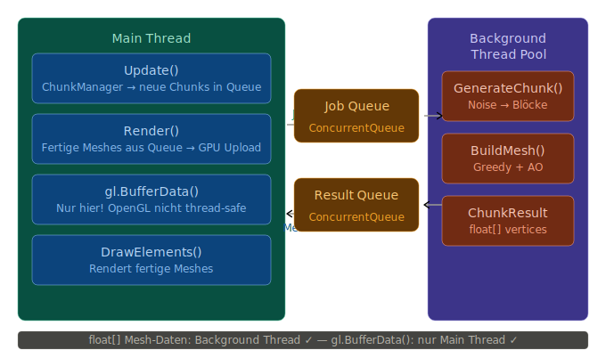

# Konzept: Multithreading für Chunk-Generierung
Das Problem das wir lösen:
```
Aktuell — alles im Main Thread:
─────────────────────────────
Frame 1: Update → ChunkManager findet neue Chunks
Frame 2: GenerateChunk() → 2ms
Frame 3: BuildMesh()     → 3ms
         ↑
         Main Thread blockiert → FPS-Einbruch beim Laden
```
Mit Multithreading:
```
Main Thread:              Background Thread:
────────────              ─────────────────
Update/Render läuft       GenerateChunk()
immer flüssig         ←── BuildMesh()
                          fertige Meshes in Queue
```
## Die drei kritischen Konzepte
### 1. Thread Safety — Was darf parallel laufen?
```
Sicher parallel:     GenerateChunk()  — liest nur Noise, schreibt in eigenen Chunk
                     BuildMesh()      — liest Chunk-Daten + SampleBlock()
                     
Nicht sicher:        gl.* Aufrufe     — OpenGL ist nicht thread-safe!
                     World Dictionary — concurrent reads/writes = Crash
```
### 2. Producer-Consumer Pattern
```
Background Thread (Producer):
    GenerateChunk → BuildMesh → fertig → in ConcurrentQueue

Main Thread (Consumer):
    Pro Frame: max N Einträge aus Queue nehmen
    gl.BufferData() aufrufen (OpenGL nur im Main Thread!)
```
### 3. Das OpenGL Problem
Mesh-Daten (float[] vertices) können im Background berechnet werden — aber der Upload zur GPU (gl.BufferData) muss im Main Thread passieren:
```
Background:   float[] vertices = GreedyMeshBuilder.Build()  ✓
Main Thread:  gl.BindBuffer(); gl.BufferData(vertices)      ✓
```
## Die Architektur



## Was wir konkret nutzen
C# hat dafür bereits alles eingebaut:
```csharp
// Job Queue — Thread-safe
ConcurrentQueue<ChunkJob> _jobQueue = new();

// Result Queue — Thread-safe
ConcurrentQueue<ChunkResult> _resultQueue = new();

// Task.Run für Background-Arbeit
Task.Run(() => {
    while (_running) {
        if (_jobQueue.TryDequeue(out var job))
        {
            var chunk = GenerateChunk(job.X, job.Z);
            var mesh  = GreedyMeshBuilder.Build(chunk, world);
            _resultQueue.Enqueue(new ChunkResult(job.X, job.Z, mesh));
        }
        else Thread.Sleep(1); // kurz warten wenn keine Jobs
    }
});

// Im Main Thread pro Frame:
while (_resultQueue.TryDequeue(out var result))
{
    // GPU Upload — nur hier erlaubt
    _chunkRenderer.UploadMesh(result);
}
```