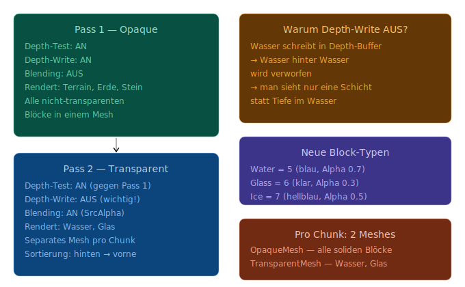

# Konzept: Transparenz in OpenGL
Das Problem mit Transparenz ist die Render-Reihenfolge. OpenGL's Depth-Test verwirft Fragmente die hinter bereits gerenderten liegen — aber bei transparenten Objekten wollen wir das nicht, wir wollen beide sehen.
```
Falsche Reihenfolge:        Richtige Reihenfolge:
─────────────────────       ─────────────────────
1. Wasser rendern           1. Alle opaken Blöcke rendern
2. Terrain dahinter         2. Transparente von hinten nach vorne
   wird verworfen! ✗           sortiert rendern ✓
```
Der klassische Ansatz heißt Two-Pass Rendering:



Die wichtigen Details
Depth-Write AUS ist der kritischste Punkt. Wenn Wasser in den Depth-Buffer schreibt, blockiert es das Rendern von weiterem Wasser dahinter — man sieht keine Wassertiefe.
Sortierung ist für Chunks optional — wir sortieren Chunks von hinten nach vorne, aber innerhalb eines Chunks sortieren wir nicht einzelne Faces. Das ist der pragmatische Kompromiss den auch Minecraft nutzt.
Wasser-Farbmischung im Shader:
```glsl
// Wasser: eigene Farbe mit Terrain-Farbe mischen
vec4 waterColor = vec4(0.1, 0.4, 0.8, 0.7);  // blau, 70% opak
FragColor = mix(waterColor, terrainColor, 0.3); // 30% Terrain durchschimmernd
```