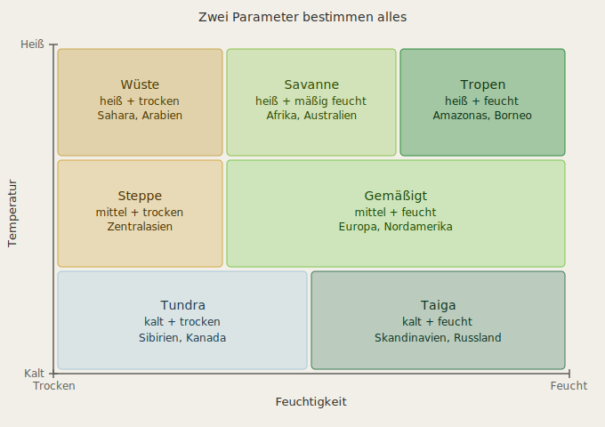

## Das Grundprinzip: Klimazonen der Erde
Die Erde hat Klimazonen die primär durch zwei Parameter bestimmt werden:
```
Temperatur  (abhängig von: Breitengrad, Höhe)
Feuchtigkeit (abhängig von: Entfernung zum Meer, Winde)
```
Das klassische Modell dafür ist das Köppen-Klimaklassifikationssystem — aber für ein Spiel vereinfachen wir es auf das Wesentliche:
 

## Die entscheidende Designfrage
Wie werden Temperatur und Feuchtigkeit in der Spielwelt berechnet? Es gibt zwei Ansätze:

### Ansatz A: Koordinaten-basiert (wie die Erde)
```
Temperatur  = f(Welt-Z)   → Z-Achse = Breitengrad
                             Nord = kalt, Süd = warm
Feuchtigkeit = Noise       → unabhängiger Noise-Wert
```
Das erzeugt horizontale Klimazonen — Richtung Norden wird es kälter, genau wie auf der Erde. Sehr intuitiv, sehr realistisch.

### Ansatz B: Beide Parameter als Noise
```
Temperatur   = Noise1(x, z)
Feuchtigkeit = Noise2(x, z)
```

Völlig freie Verteilung — Wüste neben Tundra möglich. Weniger realistisch, aber mehr Spielfreiheit.

Meine Empfehlung: Ansatz A mit einem kleinen Twist:
```csharp
// Temperatur: primär Z-basiert, leicht durch Noise moduliert
float latitude = worldZ / WorldScale;          // -1 bis +1
float tempNoise = noise.GetNoise(x, z) * 0.2f; // ±20% Variation
float temperature = latitude + tempNoise;       // -1 (kalt) bis +1 (heiß)

// Höhen-Einfluss: Berg = kälter
float altitude = (terrainHeight - SeaLevel) / MaxHeight;
temperature -= altitude * 0.3f;

// Feuchtigkeit: reiner Noise
float humidity = humidityNoise.GetNoise(x, z); // -1 bis +1
```
Das gibt realistische Klimazonen die leicht durch Berge und Breite variieren — aber trotzdem vorhersagbar bleiben.

## Einfluss auf das bestehende System
Das Schöne ist: unser BiomeDefinition-System ist bereits so designed dass es das unterstützt:
```csharp
// Statt: "Biom-Noise bestimmt Biom"
// Neu:   "Temperatur + Feuchtigkeit bestimmen Biom"

BiomeDefinition GetBiome(float temperature, float humidity)
{
    return (temperature, humidity) switch {
        ( > 0.5f, < -0.2f) => Desert,
        ( > 0.5f,  > 0.5f) => Tropics,
        ( > 0.0f,  > 0.0f) => Temperate,
        ( < -0.3f, _     ) => Tundra,
        // ...
    };
}
```

## Höhe als dritter Parameter

Berge bekommen automatisch Schnee wenn sie hoch genug sind:
```
SeaLevel    = Y 64  → Wasser
Treeline    = Y 100 → keine Bäume mehr
Snowline    = Y 120 → Schnee beginnt
MaxHeight   = Y 200 → reiner Stein/Schnee
```

Diese Schwellenwerte können pro Klimazone variieren — in den Tropen liegt die Schneegrenze höher als in der Tundra.