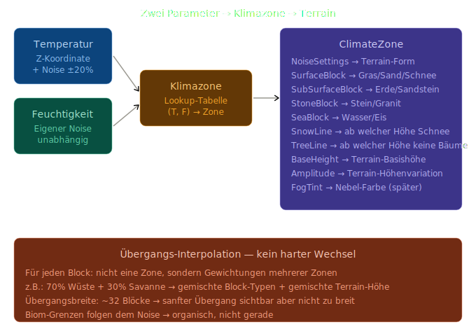

## Konzept: Klimazonen-System

### Die Grundidee: Zwei Parameter bestimmen alles

Statt einem einzigen Noise-Wert für Terrain nutzen wir **drei unabhängige Noise-Werte**:

```
Temperatur-Noise  (sehr niedrige Frequenz, langsame Änderung)
    + Z-Koordinate als Breitengrad-Einfluss

Feuchtigkeits-Noise (niedrige Frequenz, unabhängig)

Höhen-Noise (wie bisher, aber pro Klimazone unterschiedlich)
```

Diese zwei Parameter (`Temperatur` + `Feuchtigkeit`) bestimmen zusammen die Klimazone — genau wie auf der echten Erde.



## Die Klimazonen im Detail

Wir implementieren 6 Zonen für den Anfang — das ist genug für visuelle Abwechslung ohne zu komplex zu werden:

```
Temperatur ↑
           │  Wüste      Savanne    Tropen
           │  (heiß+     (heiß+     (heiß+
           │  trocken)   mittel)    feucht)
           │
           │  Steppe     Gemäßigt   Taiga
           │  (mittel+   (mittel+   (kalt+
           │  trocken)   feucht)    feucht)
           └─────────────────────────────→ Feuchtigkeit
```

Jede Zone hat **eigene Terrain-Parameter**:

```
Wüste:     flach, Sand, wenig Variation, keine Schneelinie
Savanne:   leichte Hügel, trockenes Gras, vereinzelt
Tropen:    hügelig, sattes Grün, tief BaseHeight (viel Meer)
Steppe:    mittelflach, trockenes Gras
Gemäßigt:  hügelig, Gras, Erde — unser aktuelles Terrain
Taiga:     bergig, hohe Amplitude, Schnee ab Y=100
```

## Das wichtigste Konzept: Smooth Blending

Der Übergang zwischen Zonen ist **der** Unterschied zu simplen Biomen. Statt:

```
Block X=100: Wüste
Block X=101: Savanne  ← harter Schnitt, sieht schrecklich aus
```

Nutzen wir Gewichtungen:

```csharp
// Für Position (worldX, worldZ):
float t = Smoothstep(0, blendWidth, distanceToZoneBorder);

float terrainHeight = Lerp(
    desert.SampleHeight(worldX, worldZ),
    savanna.SampleHeight(worldX, worldZ),
    t
);

byte surfaceBlock = t < 0.5f ? BlockType.Sand : BlockType.DryGrass;
```

## Was sich im Code ändert

```
Neu erstellen:
  World/ClimateZone.cs      → Definition einer Klimazone
  World/ClimateSystem.cs    → Temperatur/Feuchtigkeit berechnen,
                              Zonen-Lookup, Blending

Anpassen:
  World/WorldGenerator.cs   → nutzt ClimateSystem statt direktem Noise
  World/NoiseSettings.cs    → bleibt, wird pro Zone verwendet
  World/BlockType.cs        → neue Block-Typen (DryGrass, Snow, etc.)
  Rendering/ArrayTexture.cs → neue Texturen für neue Block-Typen
```

## Der kritische Unterschied zu früher

Bisher:
```csharp
float height = _noise.GetNoise(worldX, worldZ) * amplitude + baseHeight;
```

Neu:
```csharp
var climate  = _climateSystem.Sample(worldX, worldZ);
float height = climate.SampleHeight(worldX, worldZ);
byte surface = climate.GetSurfaceBlock(height);
```

`climate` ist eine gemischte Klimazone mit interpolierten Werten — nicht eine einzelne Zone.

## Neue Block-Typen die wir brauchen

```
DryGrass  = 8   (Savanne/Steppe — trockenes Gelbgrün)
Snow      = 9   (Taiga/Berge — weiß)
Ice       → bereits vorhanden (= 7)
Sand      → bereits vorhanden (= 4)
```

Das sind nur 2 neue Block-Typen — überschaubar.
