# Konzept: WorldTime und Tageslichtzyklus
Die zentrale Variable
Alles beginnt mit einer einzigen Zahl:
```csharp
double WorldTime;  // 0.0 bis 24.0 — Stunden des Tages
```

Das ist der "Herzschlag" der Spielwelt. Alles andere — Skybox-Farben, später Wetter, Jahreszeit, Beleuchtung — ist eine Funktion dieser einen Variable.
```
WorldTime = 0.0   → Mitternacht
WorldTime = 6.0   → Sonnenaufgang
WorldTime = 12.0  → Mittag
WorldTime = 18.0  → Sonnenuntergang
WorldTime = 24.0  → Mitternacht (= 0.0)
```
Wie die Zeit läuft
```csharp
// In Update(double fixedDelta):
WorldTime += fixedDelta * TimeScale;
if (WorldTime >= 24.0) WorldTime -= 24.0;

// TimeScale bestimmt Geschwindigkeit:
// TimeScale = 1.0   → 1 Spielsekunde = 1 Echtzeitsekunde (24h Tag)
// TimeScale = 60.0  → 1 Spielminute  = 1 Echtzeitsekunde (24min Tag)
// TimeScale = 720.0 → 1 Spielsekunde = 30min Echtzeit   (Minecraft-ähnlich)
```
Minecraft hat einen ~20-Minuten-Tag — TimeScale ≈ 72.

## Die Skybox-Farbkurve
Das ist der interessanteste Teil. Statt nur zwei Farben (Tag/Nacht) definieren wir Schlüsselpunkte über den Tag:



## Die Interpolation
Zwischen den Schlüsselpunkten wird einfach linear interpoliert:
```csharp
// Finde die zwei umgebenden Schlüsselpunkte
SkyKey before = keys.Last(k => k.Time <= worldTime);
SkyKey after  = keys.First(k => k.Time > worldTime);

// Wie weit sind wir zwischen den beiden?
float t = (worldTime - before.Time) / (after.Time - before.Time);

// Farben interpolieren
ZenithColor  = Vector3.Lerp(before.Zenith,  after.Zenith,  t);
HorizonColor = Vector3.Lerp(before.Horizon, after.Horizon, t);
```

Das ergibt automatisch weiche Übergänge — kein komplexer Shader nötig.

### Die Architektur
```
WorldTime (in GameContext)
    │
    ├── läuft in Update() weiter
    │
    ├── SkyColorCurve berechnet aktuelle Farben
    │       └── Schlüsselpunkte + Interpolation
    │
    └── Skybox liest Farben jeden Frame
```